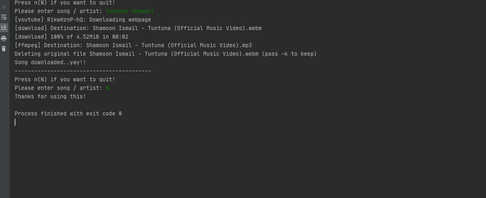

## Download your favourite music from youtube!

A simple script in python which is using [youtube-dl](https://github.com/ytdl-org/youtube-dl) to download the songs from youtube.

## Requirements

- Make sure you have the [python](https://www.python.org/downloads/) environment setup on your system.

- Run the following in the directory containing the script files.

```python
pip install -r requirements.txt
```

- Make sure you have [ffmpeg](https://ffmpeg.org/) installed on your system. It will get used by youtube-dl to convert any downloaded audio file to `mp3`.


- Get you api key for [YT Data API v3](https://developers.google.com/youtube/v3/getting-started#before-you-start) and put it in the [`config.py`](./config.py) file inplace of `YOUR_API`. This is being used to query youtube's database'.

You are good to go...

## Usage

Just run the following command:

```python
python download_yt.py
```
Enter the name of artist / song you want to download. The mp3 for that will be downloaded in the present directory itself.



--------------

