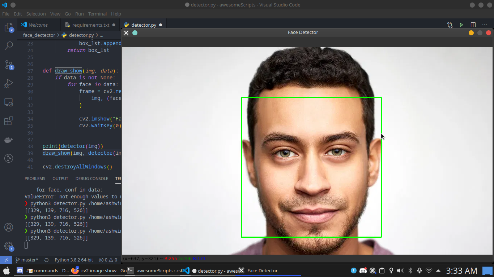

# Face Detector

#### Features
- Detect Faces with good accuracy without high-end pc in seconds.
- Multiple Faces can detected. 

#### Installing

Run Command 
```bash
pip install -r requirements.txt
```

This will install needed Libraries (opencv-python)

#### Using

```bash 
python3 detector /path/to/img
```
Just use the above command. 

##### Samaples



