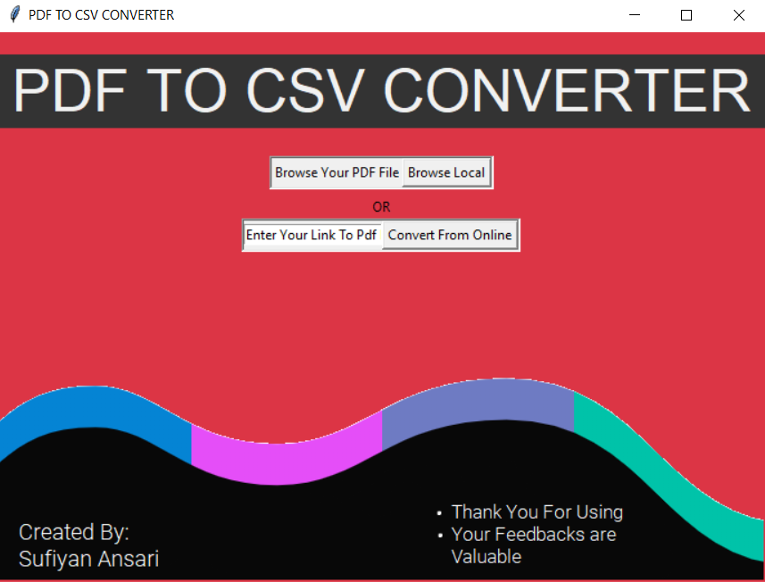
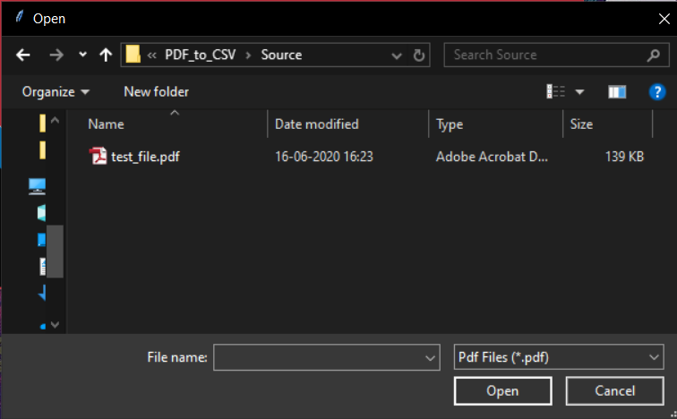
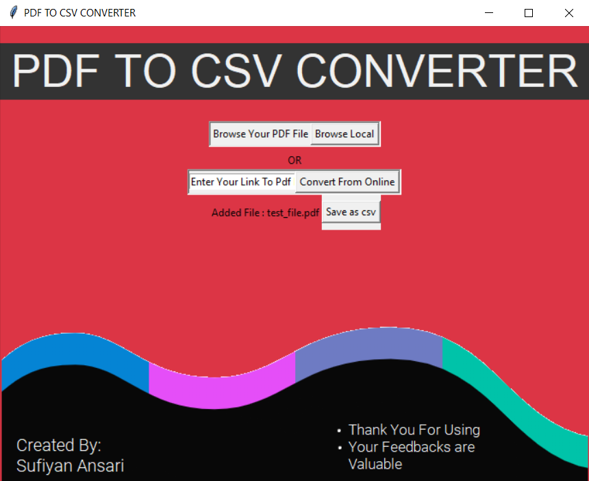
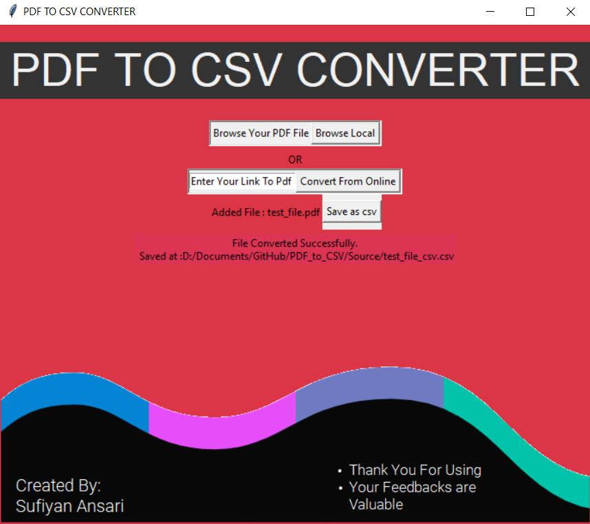
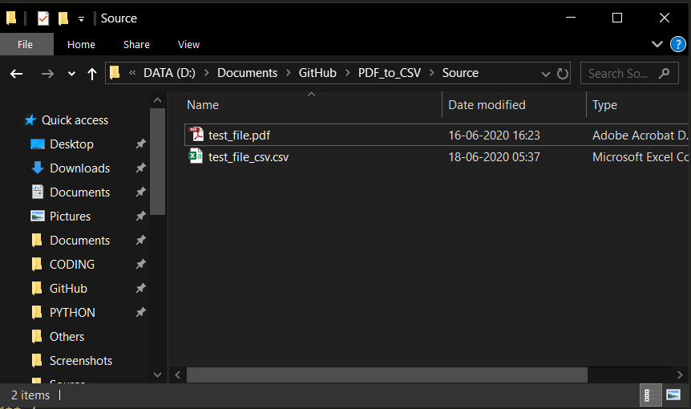

# PDF to CSV CONVERTER
A Simple GUI tool that converts the pdf tables to csv format

## How To Use
- You must have python for this to run in your system
- install libraries from requirement.txt or manually
```
pip install -r requirement.txt
```
or
```
pip install tabula
```
tkinter in built in package with python

## Screenshots

- Main Screen

<br>

- Browse The File
- 
<br>

- Click on save button

<br>

- It will few seconds to convert, depending upon the size of pdf

<br>

- You will find the file as .csv in the same folder as source file

