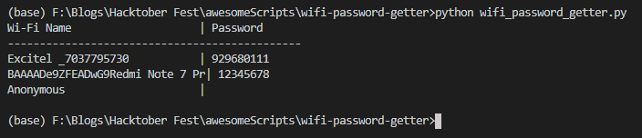

## Stored Wifi Password Getter

This will help to get any stored wifi connection names and their passwords from your device along with open connections. It will only work
on windows os.

## Installation

- Install Python to your system if it's not available.

**Now you are ready to run the code**

## Note:

- Copy the file **wifi_password_getter.py** and store it in any folder or Desktop.

## Steps to run:

- Open the **wifi_password_getter.py** file i.e run it.
- To run it, you can open command prompt/shell/terminal in the containing folder and type the following command:
    ```
    python wifi_password_getter.py
    ```

## Output:



## Contributor

- **Harshit Saraswat (https://github.com/harshit-saraswat)**  
  
