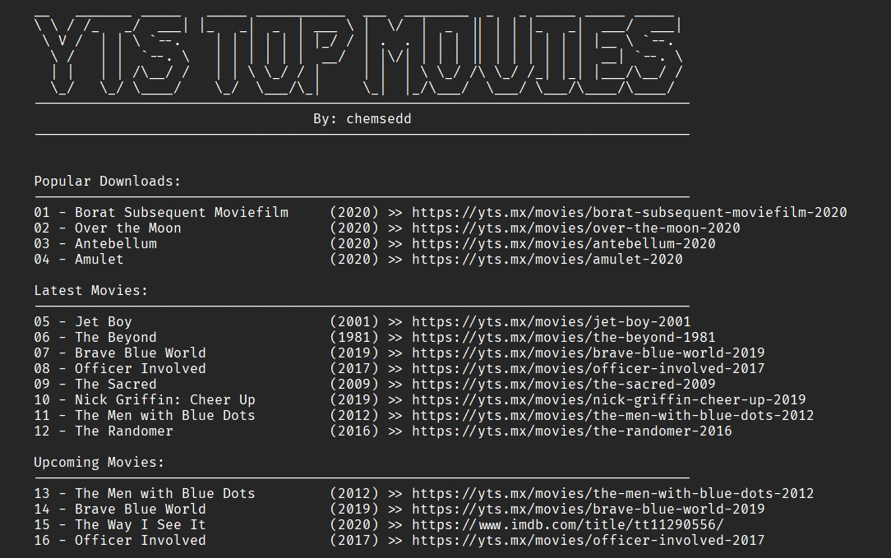

# YTS Top Movies
List top movies from the YTS website, and displays them with some information.

The script scrappes the HTML from the website shows:

- Most Popular Movies
- Latest Uploads
- Upcoming movies

```bash
python yts-top-movies.py
```

## Example:


----------
**Main author:** [Chems Eddine Senoussi](http://github.com/chemsedd)